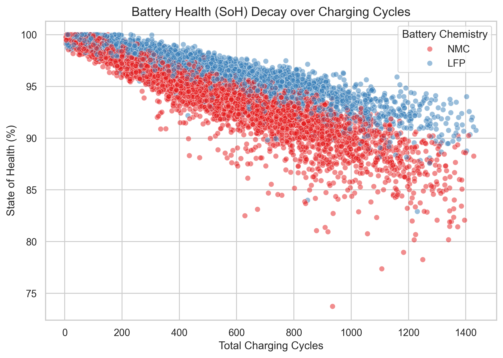
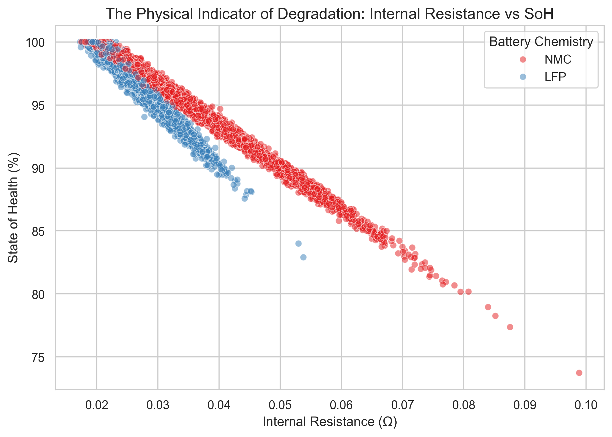
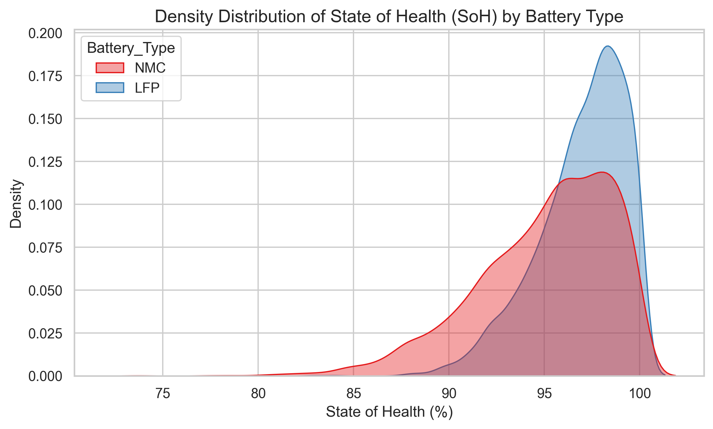
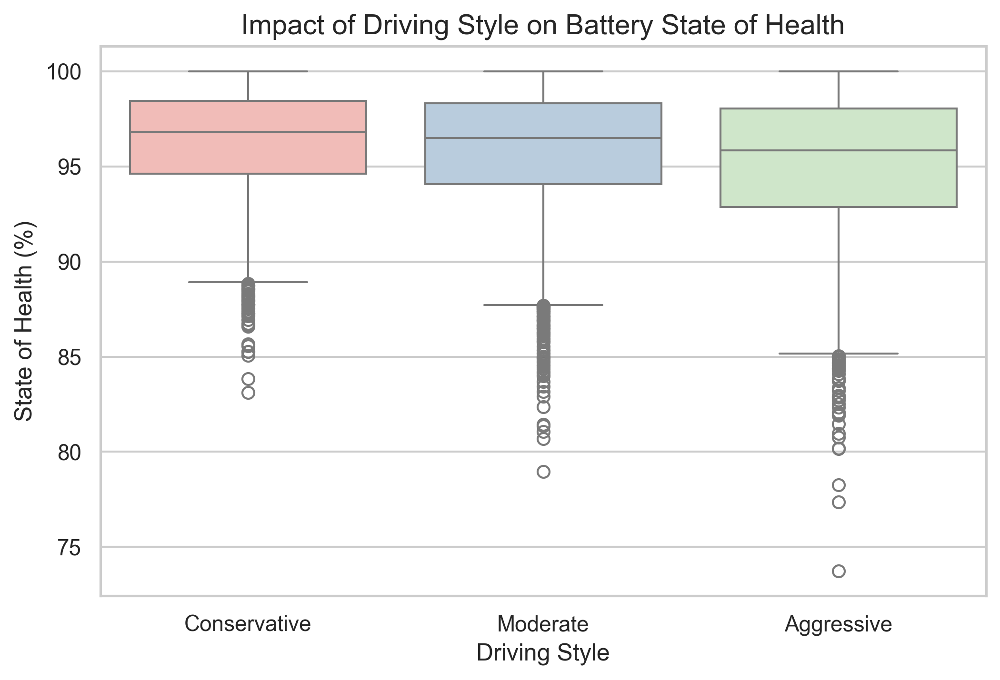
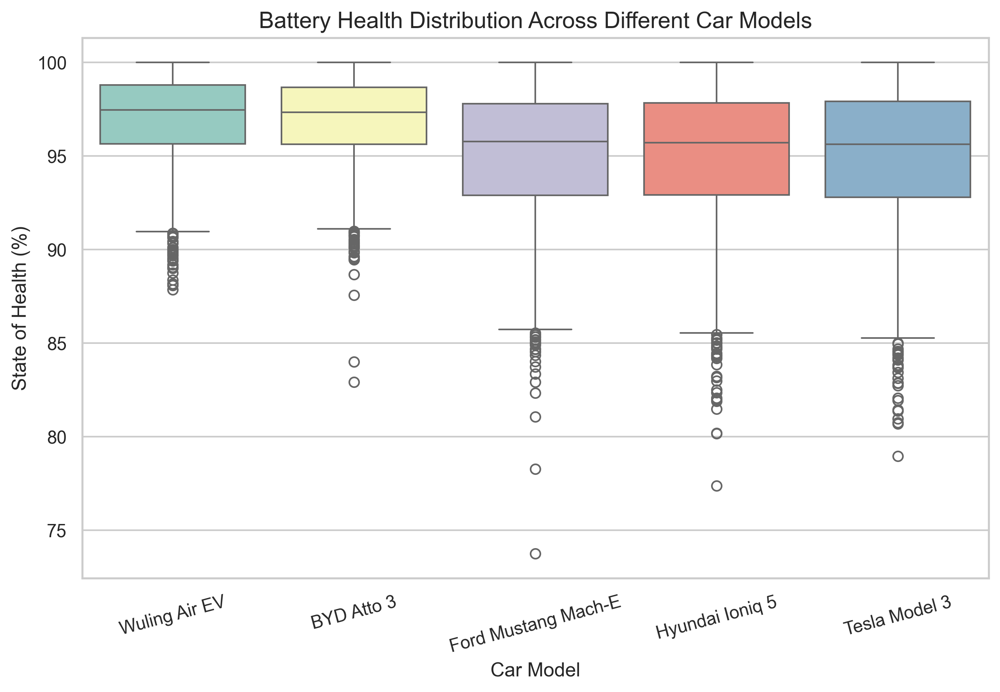
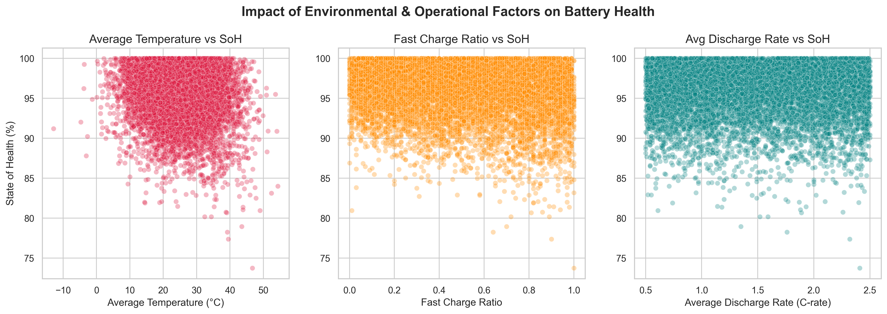
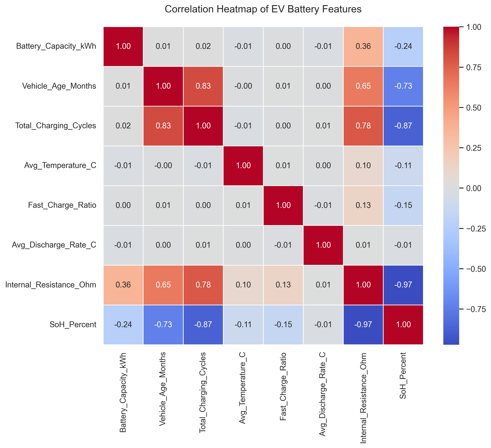

# EV Battery Degradation & Energy Usage Analysis

This project analyzes electric vehicle (EV) battery degradation patterns and energy usage behaviors using data visualization techniques in Python.

The goal is to understand how operational factors such as charging cycles, temperature, driving style, and internal resistance affect battery health (State of Health - SOH).

---

## 📊 Project Objectives

- Analyze battery degradation trends over time
- Identify key factors affecting battery health
- Visualize relationships between operational variables
- Explore vehicle-level differences in performance

---

## 🛠️ Tools & Technologies

- Python
- Pandas
- Matplotlib
- Seaborn

---

## 📁 Dataset Features

The dataset includes information such as:

- Total Charging Cycles
- Internal Resistance
- Average Temperature
- Driving Style
- Battery Type
- Car Model
- State of Health (SOH %)
- Battery Status

---

## 📊 Data Visualizations

### 1. Charging Cycles vs State of Health
Shows how battery health decreases as charging cycles increase.



---

### 2. Internal Resistance vs State of Health
Higher internal resistance is generally associated with lower battery health.



---

### 3. Battery Type Distribution (SOH Density)
Comparison of battery health across different battery types.



---

### 4. Driving Style vs State of Health
Aggressive driving behavior may contribute to faster degradation.



---

### 5. Car Model vs State of Health
Comparison of battery performance across different EV models.



---

### 6. Operational Factors Overview
Combined analysis of multiple operational variables.



---

### 7. Correlation Heatmap
Shows relationships between all numerical variables in the dataset.



---

## 📌 Key Insights

- Charging cycles have a strong negative correlation with battery health.
- Higher internal resistance indicates battery degradation.
- Temperature and driving behavior also influence SOH.
- Different car models show varying degradation patterns.

---

## 🚀 How to Run

1. Clone the repository:
```bash
git clone https://github.com/your-username/ev-battery-analysis.git
